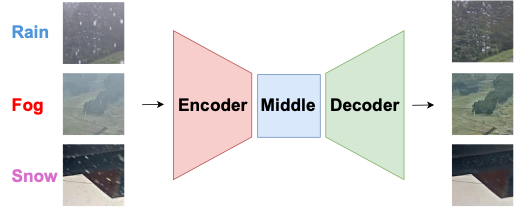

# MPDAC (IEEE Access)
This is the official code of the IEEE Access paper [Multiple Adverse Weather Removal Using Masked-Based Pre-Training and Dual-Pooling Adaptive Convolution](https://ieeexplore.ieee.org/document/10506517).

We denote our proposed method as **MPDAC** (**M**asked-based **P**re-training and **D**ual-pooling **A**daptive **C**onvolution).

**MPDAC** removes various types of degradations caused by adverse weather, including rain, fog, and snow.

<p align="center">
  
</p>

## Abstract
Removing artifacts caused by multiple adverse weather, including rain, fog, and snow, is crucial for image processing in outdoor environments. Conventional high-performing methods face challenges, such as requiring pre-specification of weather types and slow processing times. In this study, we propose a novel convolutional neural network-based hierarchical encoder-decoder model that addresses these issues effectively. Our model utilizes knowledge of feature representations obtained from masked-based pre-training on a large-scale dataset. To remove diverse degradations efficiently, we employ a proposed dual-pooling adaptive convolution, which improves representational capability of weight generating network by using average pooling, max pooling, and filter-wise global response normalization. Experiments conducted on both synthetic and real image datasets show that our model achieves promising results. The performance on real images is also improved by a novel learning strategy, in which a model trained on the synthetic image dataset is fine-tuned to the real image dataset. The proposed method is notably cost-effective in terms of computational complexity and inference speed. Moreover, ablation studies show the effectiveness of various components in our method.

## Citation
If you use this code or models in your research and find it helpful, please cite the following paper:
```
@article{yamashita2024multiple,
  title={Multiple Adverse Weather Removal using Masked-Based Pre-Training and Dual-Pooling Adaptive Convolution},
  author={Yamashita, Shugo and Ikehara, Masaaki},
  journal={IEEE Access},
  year={2024},
  publisher={IEEE}
}
```

## Acknowledgement
This code-base uses certain code-blocks and helper functions from [timm](https://github.com/rwightman/pytorch-image-models), [ConvNeXt-V2](https://github.com/facebookresearch/ConvNeXt-V2), [weightnet.pytorch](https://github.com/DequanWang/weightnet.pytorch), and [Transweather](https://github.com/jeya-maria-jose/TransWeather).
